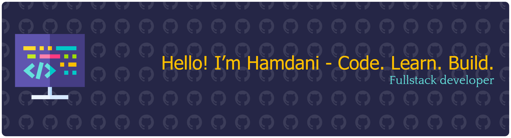

## Hi there! I'm Hamdani 👋

I'm a Fullstack developer who focuses on building clean, maintainable, and scalable applications. Working mainly with Laravel, Tailwind CSS, and modern JavaScript tools.

---

## Skills

  

---

## Connect with Me

---

## Fun Fact
I love solving bugs, especially the ones I accidentally created myself.

